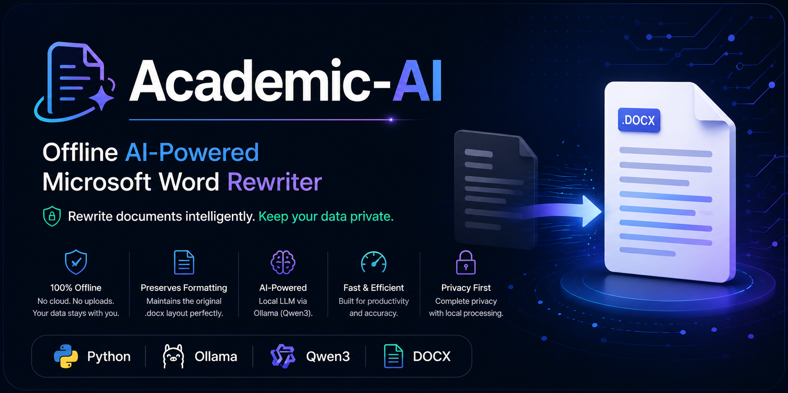

  

# Academic-AI

> **Portfolio showcase for an offline AI-powered Microsoft Word (.docx) rewriting application built with Python and Ollama.**

> **Portfolio showcase for an offline AI-powered Microsoft Word (.docx) rewriting application built with Python and Ollama.**

> **Note:** The complete source code is maintained in a private repository. This repository is intended to demonstrate the project's features, architecture, and development journey.

---

## Overview

Academic-AI is a desktop application that rewrites Microsoft Word (.docx) documents using a locally running Large Language Model (LLM).

The project was designed with two primary goals:

- Preserve original Microsoft Word formatting.
- Perform AI-powered rewriting entirely offline.

Unlike cloud-based writing assistants, Academic-AI processes documents locally using Ollama, ensuring that documents never leave the user's computer.

---

## Key Features

- ✅ Offline AI document rewriting
- ✅ Microsoft Word (.docx) support
- ✅ Multiple rewrite modes
- ✅ Paragraph rewriting
- ✅ Table rewriting
- ✅ Header rewriting
- ✅ Footer rewriting
- ✅ Automatic output filename generation
- ✅ Input validation
- ✅ Local LLM using Ollama

---

## Technologies

- Python
- Ollama
- Qwen3
- python-docx

---

## Architecture

*Architecture diagram will be added.*

---

## Screenshots

*Application screenshots will be added.*

---

## Demonstration

*A demonstration GIF/video will be added.*

---

## Source Code

The complete Academic-AI source code is maintained in a private repository.

This public repository is intended to showcase the project's functionality, architecture, and development process. It does not contain the full implementation.

If you are an employer, recruiter, interviewer, or academic reviewer and would like to review the implementation, please contact me to request temporary access to the private repository for evaluation purposes.

---

## Author

**Muhammad Faezal Satar**

GitHub: https://github.com/faezalsatar